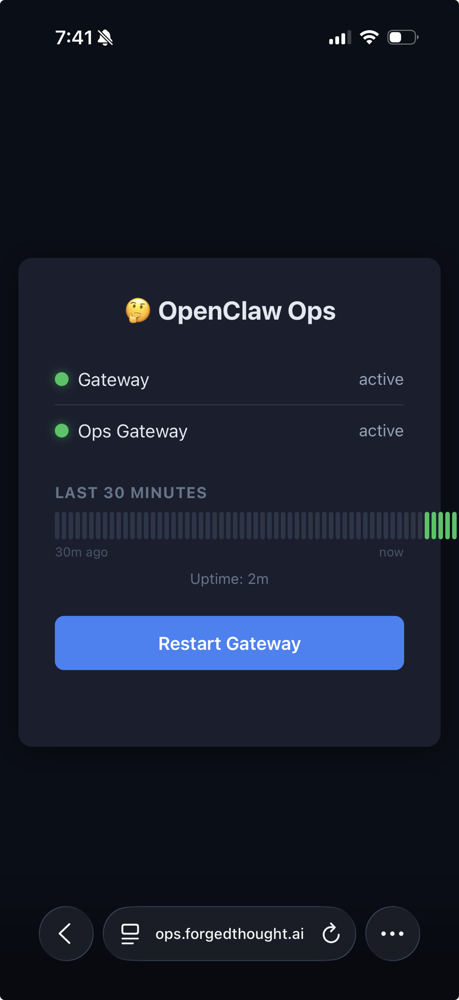

# ops-gateway

A tiny, single-binary HTTP service for out-of-band management of an [OpenClaw](https://github.com/openclaw/openclaw) gateway. Designed to run alongside the gateway as a systemd service behind a Cloudflare Tunnel with Zero Trust access.

## Screenshots

<p align="center">
  
</p>

## What it does

- **`GET /`** — Web UI with live gateway status, health history bar, restart button, and doctor
- **`GET /health`** — No auth. Returns `{"ok":true}` if ops-gateway itself is alive
- **`GET /status`** — Authenticated. Returns current gateway status + 1-hour health history
- **`POST /restart`** — Authenticated. Restarts the gateway via `systemctl --user restart openclaw-gateway`
- **`POST /doctor`** — Authenticated. Runs `openclaw doctor` (add `?fix=true` for `--fix`)

## Install

### From release binaries

Download the latest binary for your platform from the [releases page](https://github.com/aweiker/ops-gateway/releases):

```bash
# Linux amd64
curl -LO https://github.com/aweiker/ops-gateway/releases/latest/download/ops-gateway-linux-amd64
chmod +x ops-gateway-linux-amd64
sudo mv ops-gateway-linux-amd64 /usr/local/bin/ops-gateway
```

Available architectures: `linux/amd64`, `linux/arm64`, `darwin/amd64`, `darwin/arm64`, `freebsd/amd64`.

### From source

```bash
go install github.com/aweiker/ops-gateway@latest
```

Or clone and build:

```bash
git clone https://github.com/aweiker/ops-gateway.git
cd ops-gateway
go build -o ops-gateway .
```

## Authentication

Two mechanisms (either works):

1. **Cloudflare Access (Zero Trust)** — email-based OTP, session lasts 24h. Ideal for phone access.
2. **Bearer token** — `Authorization: Bearer <token>` header. For automation/scripts.

## Configuration

| Variable | Default | Description |
| --- | --- | --- |
| `OPS_TOKEN` | _(required)_ | Bearer token for API authentication |
| `OPS_PORT` | `18790` | Listen port (binds to `127.0.0.1`) |
| `OPENCLAW_BIN` | `openclaw` | Path to the OpenClaw CLI binary |

```bash
export OPS_TOKEN="$(openssl rand -hex 32)"
./ops-gateway
```

### Systemd service

```ini
[Unit]
Description=Ops Gateway

[Service]
Type=simple
ExecStart=/usr/local/bin/ops-gateway
EnvironmentFile=/path/to/env
Restart=always

[Install]
WantedBy=default.target
```

### Cloudflare Tunnel + Access

1. Create a tunnel: `cloudflared tunnel create ops`
2. Route DNS: create a CNAME record pointing to `<tunnel-id>.cfargotunnel.com`
3. Create an Access application for the hostname
4. Add an Access policy (e.g., email allowlist)

```yaml
tunnel: <tunnel-id>
credentials-file: /path/to/credentials.json

ingress:
  - hostname: ops.example.com
    service: http://127.0.0.1:18790
  - service: http_status:404
```

## Health Watchdog

The included `watchdog.sh` is a companion script designed to run as a systemd timer (every 2 minutes):

- Checks gateway health via HTTP and systemd
- Auto-restarts after 3 consecutive failures
- Sends Telegram alerts on failure/recovery (bypasses OpenClaw entirely)

```ini
[Timer]
OnBootSec=1min
OnUnitActiveSec=2min
```

## Architecture

```
Phone/Browser
    │
    ▼ (HTTPS)
Cloudflare Access (Zero Trust)
    │
    ▼ (authenticated)
Cloudflare Tunnel
    │
    ▼ (localhost)
ops-gateway (:18790)
    │
    ├──▶ systemctl restart openclaw-gateway
    ├──▶ openclaw doctor [--fix]
    └──▶ systemctl is-active openclaw-gateway
```

Zero dependencies beyond Go stdlib. ~250 lines.

## License

MIT
